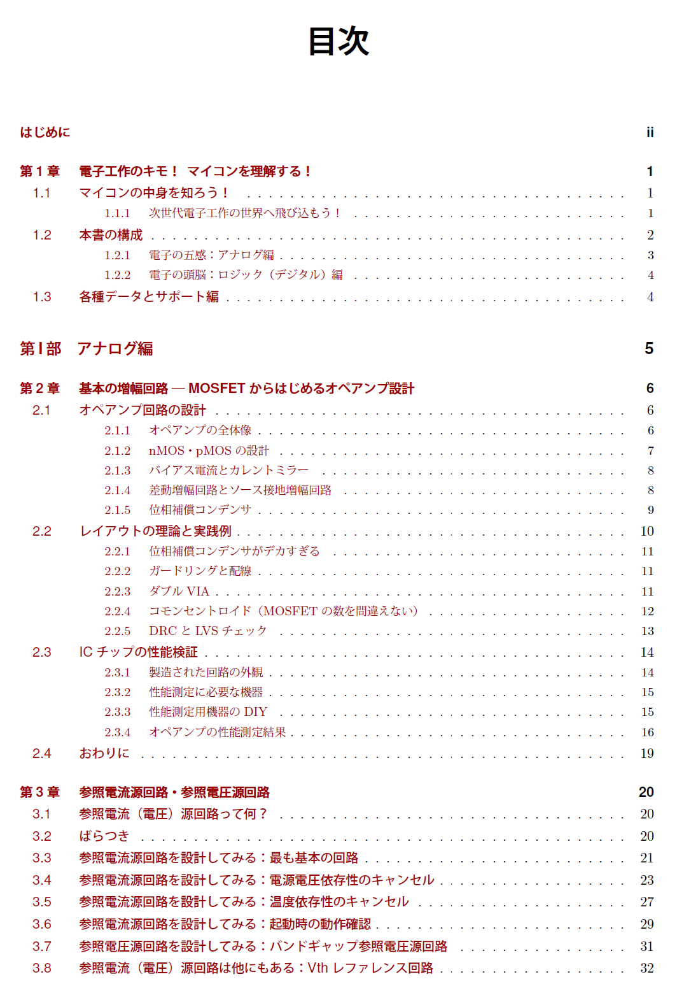
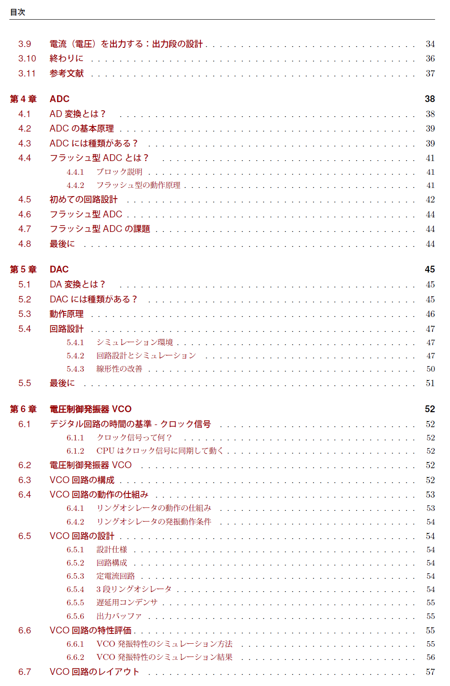
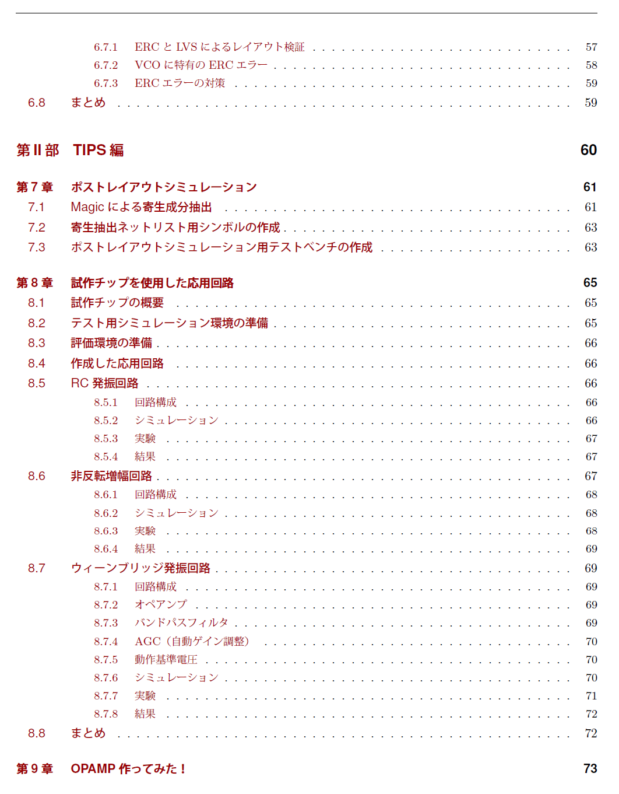
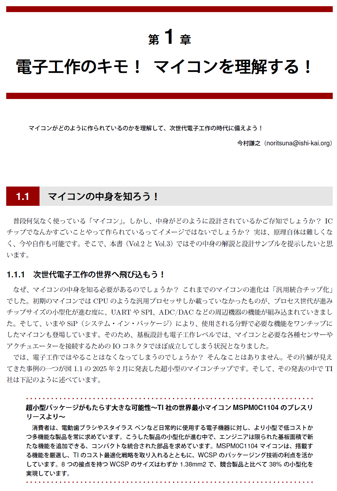
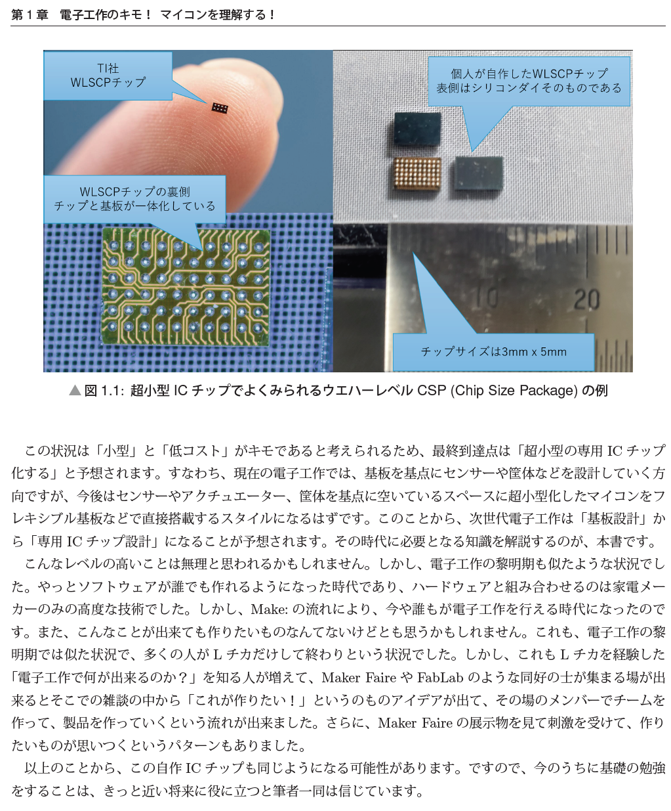

# [Open Source Silicon Magazine Vol.2](/Vol.2/)のサポートページです
普段何気なく使っている「マイコン」。しかし、中身がどのように設計されているかご存知でしょうか？ICチップでなんかすごいことやって作られているってイメージではないでしょうか？実は、原理自体は難しくなく、今や自作も可能です。そこで、正式名「Open Source Silicon Magazine Vol.2 はじめの一歩のその先へ～次世代電子工作への第一歩！マイコンチップを自作しよう！（アナログ編）～」の本書（Vol.2とVol.3）ではその中身の解説と設計サンプルを提示したいと思います。

なぜ、マイコンの中身を知る必要があるのでしょうか？
これまでのマイコンの進化は「汎用統合チップ化」でした。初期のマイコンではCPUのような汎用プロセッサしか載っていなかったものが、プロセス世代が進みチップサイズの小型化が進む度に、UARTやSPI、ADC/DACなどの周辺機器の機能が組み込まれていきました。そして、いまやSiP（システム・イン・パッケージ）により、使用される分野で必要な機能をワンチップにしたマイコンも登場しています。そのため、基板設計も電子工作レベルでは、マイコンと必要な各種センサーやアクチュエーターを接続するためのIOコネクタでほぼ成立してしまう状況となりました。
この状況は「小型」と「低コスト」がキモであると考えられるため、最終到達点は「超小型の専用ICチップ化する」と予想されます。すなわち、現在の電子工作では、基板を基点にセンサーや筐体などを設計していく方向ですが、今後はセンサーやアクチュエーター、筐体を基点に空いているスペースに超小型化したマイコンをフレキシブル基板などで直接搭載するスタイルになるはずです。このことから、次世代電子工作は「基板設計」から「専用ICチップ設計」になることが予想されます。その時代に必要となる知識を解説するのが、本書です。そこで、今のうちに基礎の勉強をすることは、きっと近い将来に役に立つと筆者一同は信じています。

みどころに関しては、[電気系ものづくりYouTuber イチケン氏](https://www.youtube.com/@ICHIKEN1)に書いていただいたまえがきに詰まっておりますので、下記を参照してもらえればと思います！

- 

## 回路図やレイアウトファイル
- [2章：基本の増幅回路―MOSFET からはじめるオペアンプ設計](files/02/)
    - [回路図](files/02//xschem/)
    - [レイアウト](files/02//klayout/)
- [3章：すべての基準となる回路ー参照電流源回路・参照電圧源回路](files/03/)
    - [回路図](files/03//xschem/)
- [4章：電子と物理を繋げる回路ーADC](files/04/)
    - [回路図](files/04//xschem/)
- [5章：電子と物理を繋げる回路ーDAC](files/05/)
    - [回路図](files/05//xschem/)
- [6章：電子と時間（クロック源）ー電圧制御発振器VCO](files/06/)
    - [回路図](files/06//xschem/)
    - [レイアウト](files/06//klayout/)
- [7章：ポストレイアウトシミュレーション](files/07/)
    - [回路図](files/07//xschem/)
    - [レイアウト](files/07//klayout/)
- [8章：試作チップを使用した応用回路](files/08/)
    - [回路図](files/08//xschem/)
    - [レイアウト](files/08//klayout/)
- [9章：OPAMP 作ってみた！](files/09/)
    - [回路図](files/09//xschem/)
    - [レイアウト](files/09//klayout/)

### EDAツールについて
上記の回路図やレイアウトファイル用のEDAツールのセットアップは、下記の情報を参照してください。  

#### EDAツールのセットアップについて
EDAツールのセットアップは、下記の情報を参照してください。  

- [ISHI会のセットアップスクリプト](https://github.com/ishi-kai/OpenEDA-PDK_SetupScript)
    - Tokai Rika Shuttle PDKをご利用ください。

上記のセットアップで動作しない場合は、ツールのバージョンによる相違が出ている可能性があります。  
その場合は、下記にEDAツールをセットアップ済みの環境を用意してありますので、こちらをご利用ください。  

- [WSLイメージ](https://www.noritsuna.jp/download/ubuntu2204_ishi-kai_EDA.WSL_TR10_OSSSM2.tar.xz)
- [VMWareイメージ for Apple Silicon](https://www.noritsuna.jp/download/ISHI-kai_EDA_vmware_TR10_OSSSM2.tar.xz)
    - ID: ishi-kai
    - Pass: ishi-kai

#### EDAツールの使い方について
インバータ回路を作りながらEDAツールの使い方を学ぶための資料を用意してあります。  
EDAツールを始めて利用する方は、こちらからお願いします。  

- [インバータ回路指南書](https://github.com/ishi-kai/OpenEDA-PDK_SetupScript/blob/main/docs/inverter_TR10.pdf)

## 正誤表
- 現在無し

## 表紙など
- 
- 
- 
- 
- 
- 
- 
- 
